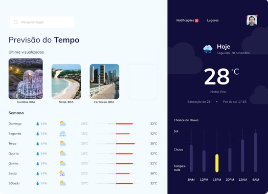

<h1>Weather Forecast Consultant<h1>

in this project I made a page where it is possible to consult the weather forecast of the week of a city chosen by the user. The site will save the last 3 queries made by the user and will show images of these respective cities. This project is a technical challenge proposed by the monitors of the ProEdu project

<h2>Technologies used<h2>

this project relies on HTML5 and CSS3 tools and the JavaScript programming language. Weather query was done behind <strong><a href = "https://openweathermap.org/api">OpenWeatherMap<a><strong> API data
